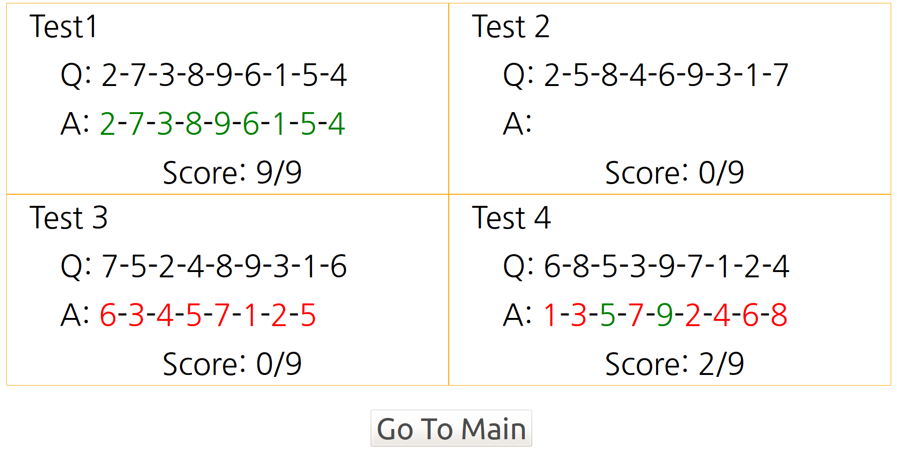

# Short Term Memory Test
This web-browser-based project is to test your short term memory. The test will show you a sequence of numbers between 1 to 9 in random order and position on 3x3 board. You should submit the seqence of numbers as you saw in restricted time to test your ability to remember this information.   
The project is initially intended to test if 4 different environments produce any differneces in human memory. That's why 4 tests are serialized with 5 seconds of interval between each test. The following is how the test proceeds.  
1. If you have downloaded all of home.html, gui.css, script.js, and jquery-2.2.0.min.js files(or you can use short_term_memory_test.html file, which is an all-in-one for home.html, gui.css and script.js), you can execute home.html(or short_term_memory_test.html) file on your web browser to start your test. (jquery-2.2.0.min.js file is also distributed in case of usage with offline mode. You can change the setting to use online reference in home.html file.) Then you will see the start button on your screen. So click it or just hit the enter(or return) key on your keyboard. 
  
2. Then you will see numbers between 1 to 9 show up one by one in uniformly random order and position. You must remember the whole sequence of numbers' appearences.  
  
3. After all numbers are shown, you will meet this edit screen. Just type the sequence of numbers in order that you think right. If you don't quite know what the number is, put 0 or some other number as a placeholder. Remember only number and arrow keys are allowed to hit on your keyboard at this moment.(or some other function keys are still available like Esc, F5, F11...) You will have 15 seconds to complete your edition and can see how many seconds you still have at right-bottom corner of the screen. If the time is less than or equal to 5 seconds, the number turns red. 
  
4. If you haven't finished all 4 tests, you will see this screen for 5 seconds before it automatically starts the next test. Step 2-4 will proceed again. 
  
5. When your all tests are done, the screen below will appear. Hit enter(or return) key or click the button.
  
6. Your 4 test scores are on the screen. 'Q', simply an abbreviation of question, means the actual sequence this application made, and 'A', of course an abbreviation of answer, is the answer you typed through the edit screen. If your answer was right, the color of number must be green, or else it's red. That's it! If you want to try 4 tests again, type enter(or return) or hit the button underneath. 
  
In any time, you can use F5 or escape key to restart the test. (But it will ask first if you really want to restart in case of accidental press of those keys.) You can also hit F11 key for a full screen, if your browser is not Windows Edge. The application is tested on Firefox and Chrome on Ubuntu 15.10, and on Chrome, Internet Explorer, and Edge on Windows7 & 11. I recommend you to use Chrome or Firefox on any OS, because there is some bug with Internet Explorer and Edge doesn't support full screen with this simple approach. They will be fixed later.  If you have any question about this application please send me an email(kimgnu@yahoo.com). Enjoy! - Kim, Gun Woo
